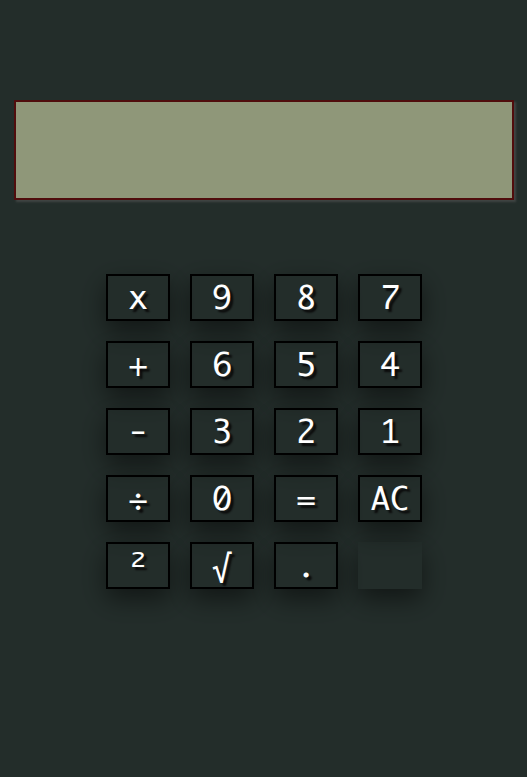

# 🧮 Simple Calculator


 

A clean, interactive **browser-based calculator** built with vanilla
**HTML, CSS, and JavaScript**, powered by **Math.js** for expression
evaluation.

🚀 **Live Demo:**
[live-demo](https://karianjahi.github.io/simple-calculator/)

------------------------------------------------------------------------

## 📸 Preview



## ✨ Features

-   ➕ Addition\
-   ➖ Subtraction\
-   ✖ Multiplication\
-   ➗ Division\
-   🟰 Expression evaluation\
-   🔢 Decimal support\
-   ² Square operation\
-   √ Square root support\
-   🧹 Clear (AC) functionality\
-   🖱 Interactive button UI\
-   📱 Responsive centered layout

------------------------------------------------------------------------

## 🛠 Tech Stack

-   **HTML5** -- Structure\
-   **CSS3** -- Styling & layout (Grid + Shadows)\
-   **JavaScript (Vanilla)** -- Logic & DOM manipulation\
-   **Math.js CDN** -- Safe mathematical evaluation

------------------------------------------------------------------------

## 📂 Project Structure

    simple-calculator/
    │
    ├── index.html
    ├── styles.css
    ├── script.js
    ├── images/
    │   └── preview.png
    ├── LICENSE
    └── README.md

------------------------------------------------------------------------

## 🧠 How It Works

1.  Button clicks are captured via `.character` class listeners.
2.  Input is stored in an array and rendered to the display.
3.  Special symbols are converted:
    -   `x` → `*`
    -   `÷` → `/`
    -   `²` → `^2`
    -   `√number` → `sqrt(number)`
4.  The processed expression is evaluated using **Math.js**.
5.  The result is displayed on screen.

------------------------------------------------------------------------

## 📦 Installation (Run Locally)

``` bash
git clone https://github.com/karianjahi/simple-calculator.git
cd simple-calculator
```

Then open:

    index.html

in your browser.

------------------------------------------------------------------------

## 🌍 Deployment

This project is deployed using **GitHub Pages**.

To deploy: 1. Go to **Settings → Pages** 2. Select branch `main` 3. Set
folder to `/ (root)` 4. Save

Your app will be available at:

    https://karianjahi.github.io/simple-calculator/

------------------------------------------------------------------------

## 🔮 Possible Improvements

-   Keyboard input support
-   History log panel
-   Dark / Light theme toggle
-   Better error handling
-   Scientific calculator expansion
-   Accessibility enhancements

------------------------------------------------------------------------

## 📸 Preview


------------------------------------------------------------------------

## 📄 License

This project is licensed under the **MIT License**.

------------------------------------------------------------------------

## 👤 Author

**Karianjahi**\
GitHub: https://github.com/karianjahi

------------------------------------------------------------------------

If you found this project helpful, feel free to ⭐ the repository!
